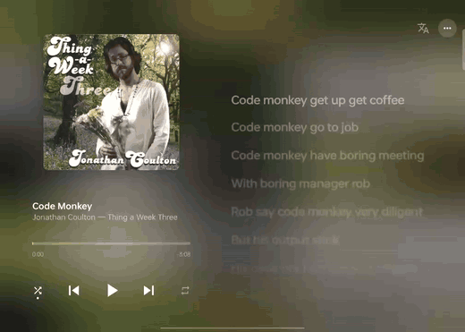

# Lyrics Card

[](LICENSE)
[](https://developer.android.com/about/versions/oreo)
[](https://developer.spotify.com/documentation/android)

**A lyrics app made for Spotify on Android. Using a standard Android media session and MediaStyle notification, it puts real-time synced lyrics into the system's live media surfaces (the media notification / control-center card, the lock screen, and vendor "island" / capsule-style live activities) and adds a polished Apple Music / Lyricify-style lyric player. No root, no modified Spotify.**

**English** · [简体中文](README-zh.md) · [繁體中文](README-zh-TW.md) · [日本語](README-ja.md)

> ⚠️ **Copyright notice:** lyrics belong to their writers and publishers. NetEase, QQ Music and Kugou are non-public endpoints, and using or caching their lyrics **may raise copyright and terms-of-service issues**. Viewing them on your own phone while you listen is generally low risk; **do not share, export or publish cached lyrics, or use them commercially**. See [Content sources and compliance](#content-sources--compliance) (not legal advice).

> 💳 **Playback control needs Spotify Premium:** Spotify documents that its playback-control endpoints (pause, skip, seek…) [only work for Premium users](https://developer.spotify.com/documentation/web-api/reference/skip-users-playback-to-next-track), and on Free mobile [Smart Shuffle is always on](https://support.spotify.com/us/article/shuffle-play/) with [limited skips](https://support.spotify.com/us/article/your-premium-benefits/). With a Free account, this app's play, skip, seek, shuffle and repeat buttons may do nothing, but lyrics still show.

[Features](#features) · [Quick Start](#quick-start) · [Permissions](#permissions) · [Update Log](#update-log) · [Architecture](#architecture) · [Credits](#credits) · [Content Sources & Compliance](#content-sources--compliance) · [Disclaimer](#disclaimer)

---

## Features

### Live media surfaces

- The current lyric line appears in the native MediaStyle notification, the control-center media card, the lock screen, and vendor "island" / capsule-style live activities that read media sessions.
- When Spotify pushes its own session back to the top slot (track change, resume, playback moving back from another device, after another app's audio, after Spotify restarts), the app takes the top slot back automatically.

Tested mainly on OPPO ColorOS, where the lock-screen island (锁屏岛) and Fluid Cloud (流体云) work best.

<!-- TODO: add these user-supplied images under docs/images/, then uncomment:



-->

> The author only has a few (ColorOS) devices and can't test many ROMs. If you're interested, or it misbehaves on another vendor's OS (MIUI/HyperOS, OriginOS, MagicOS, One UI, etc.), please [open an issue](https://github.com/absswds/Spotify_lyric/issues) or send a PR.

### Player

- Mesh-gradient background sampled from the cover.
- Word-by-word sweep with lift when real word timing exists (TTML / YRC / QRC / KRC); whole-line highlight otherwise.
- Distance blur and dimming, spring scrolling.
- Intro countdown dots and mid-song interlude dots (gaps of 6 s or more).
- Duet lines on opposite sides; translations under each line.
- Rolling, blurred time digits; marquee for long titles and albums.
- Layouts: phone portrait, landscape (Lyricify-like left block with cover, title, translate and menu buttons, progress, transport), tablet portrait, and split screen.

### Lyric sources

| Source | Notes |
|--------|-------|
| AMLL TTML DB | Exact match by Spotify track id; word timing, duets |
| NetEase Cloud Music | YRC word timing + translation |
| QQ Music | QRC word timing, LRC fallback |
| Kugou | KRC word timing |
| LRCLIB | Default source |

- All sources are searched in parallel, finishing early once a good enough result is in.
- Candidates are scored on title / artist / duration match and cross-checked for timing agreement between sources. The onboarding and Settings let you prefer word-by-word or line-by-line lyrics; the selected timing type is preferred when choosing a match.
- Low-confidence matches are not shown (a same-title song by another artist is worse than no lyrics).
- Manual search / correction and manual `.lrc` import.

### Offset

- Saved per song and per lyric source (each source's timing is adjusted separately).
- Plus a global offset in Settings.

### Caching and offline

- LRCLIB, AMLL and manual lyrics are cached for offline use.
- Lyrics from unofficial sources (NetEase, QQ Music, Kugou) are on by default, with a dedicated onboarding page explaining their use and responsibility; turn them off in onboarding or Settings to use LRCLIB and AMLL only. They stay in memory by default and are cached on the device only after you agree in the onboarding guide (changeable in Settings). The cache is for your own viewing; do not share or export it.
- Offline mode: when App Remote can't connect, the app reads Spotify's own MediaSession through [notification access](#permissions).

### Playback on another device (Spotify Connect)

- When playing on another device, the phone's Spotify often keeps reporting a stale paused state, so the app follows the Spotify Web API instead (`GET /v1/me/player`, scope `user-read-playback-state`, one [extra authorization](#permissions)).
- Polls every 5 s while another device plays; backs off up to 2 min when nothing is playing.
- The menu shows "Syncing another device".
- The token lasts one hour and is renewed when you open the app.

### Translation and Chinese script

- On-device ML Kit translation; shipped translations (NetEase) shown per line.
- In Chinese UI locales you choose (in onboarding and Settings) whether Traditional/Simplified conversion replaces the lyrics in place or appears below them.

### Battery

- Wake lock released while paused; the foreground service stops after 10 min paused and asks Android to stop Spotify too.
- Web API polling backs off; the UI copy stops polling in the background.

### Other

- Onboarding guide.
- 4 UI languages (Simplified Chinese, Traditional Chinese, English, Japanese) and themes.

### Known limits

- ColorOS only: "Hans" may freeze the app a few seconds after Spotify pauses. While frozen it misses Spotify's resume and can't handle media-card buttons; opening the app thaws it.
- Playback control through App Remote (skip etc.) needs Spotify Premium.
- The Web API token needs hourly renewal, which requires opening the app.

---

## Quick Start

### Prerequisites

- **JDK 17**
- **Android SDK** (compileSdk 35, minSdk 26)
- **Spotify app** installed and signed in
- A Client ID from an app registered on the [Spotify Developer Dashboard](https://developer.spotify.com/dashboard)

### Getting a Client ID

1. Open the [Spotify Developer Dashboard](https://developer.spotify.com/dashboard) and sign in.
2. Click **Create App** and fill in:

   | Field | Value |
   |-------|-------|
   | **App name** | Anything, e.g. "Lyrics Card" |
   | **App description** | e.g. "Personal lyrics display app" |
   | **Website** | Leave empty |
   | **Redirect URIs** | `spotifylyricsproxy://callback` (exact match, no trailing slash or spaces) |
   | **Android packages** | `com.example.spotifylyricsproxy` |
   | **Android SHA-1 fingerprint** | SHA-1 of the certificate that signs your APK (`./gradlew :app:signingReport`) |
   | **Which API/SDKs** | Tick **Android** and **Web API** (the Web API is used for other-device sync and playlists) |

3. Click **Save** and copy the **Client ID** at the top.

> Spotify verifies the package name and signing SHA-1. A debug APK built on another machine has a different key: installing over it fails with `INSTALL_FAILED_UPDATE_INCOMPATIBLE`, and Spotify rejects the connection. Register your release certificate's SHA-1 too before publishing.

> The Client ID is embedded in the APK and is not a secret, but don't commit it to a public repo.

### Building from source

```bash
git clone https://github.com/absswds/Spotify_lyric.git
cd Spotify_lyric
cp local.properties.example local.properties
```

Edit `local.properties` (use forward slashes in `sdk.dir` on Windows):

```properties
sdk.dir=C:/Users/YourUser/AppData/Local/Android/Sdk
spotify.client.id=YOUR_SPOTIFY_CLIENT_ID
```

Build and install:

```bash
./gradlew testDebugUnitTest assembleDebug
adb install -r app/build/outputs/apk/debug/app-debug.apk
```

> Without `spotify.client.id` the build still succeeds but bakes in `MISSING_CLIENT_ID`, and App Remote / auth silently fail. Close Android Studio before building from the command line.

### First run

1. Open the app and follow the onboarding guide ([notification permission](#permissions), [notification access](#permissions), Chinese script option, etc.).
2. Tap **Connect Spotify** and [authorize](#permissions) in Spotify.
3. Play any song. Lyrics appear in the player, the notification and the media card.

See [Permissions](#permissions) for what each one is for.

### Permissions

| Permission / authorization | Why | Required? |
|----------------------------|-----|-----------|
| Notification permission (Android 13+) | Shows lyrics in the notification, media card, lock screen and capsules | Required on Android 13+, or no lyrics appear in the notification |
| Spotify authorization (App Remote) | Connects to Spotify to read the current track and position and control playback | Required |
| Notification access | Offline mode: when App Remote can't connect, reads Spotify's own media session (track, artwork, controls); it does not read notification content | Optional |
| Spotify Web API authorization (`user-read-playback-state`) | Syncs playback on another device (Spotify Connect); requested once the first time you play elsewhere; the token lasts one hour and renews when you open the app | Optional |
| Battery optimization exemption | Makes the system less likely to kill the app in the background; see [Keeping it alive](#keeping-it-alive-in-the-background-vendor-roms) | Optional (recommended) |
| Auto-start / 关联启动 for Spotify (system settings) | Lets a force-stopped Spotify be woken; see [Keeping it alive](#keeping-it-alive-in-the-background-vendor-roms) | Optional, some vendor ROMs only |

### Keeping it alive in the background (vendor ROMs)

Many vendor ROMs (ColorOS, MIUI/HyperOS, OriginOS, MagicOS, etc.) aggressively kill background apps. If lyrics stop updating after a while:

1. **[Disable battery optimization](#permissions)**: Settings → Battery → this app → Don't optimize / allow full background activity (names vary by ROM).
2. **[Allow auto-start / 关联启动 for Spotify](#permissions)**: otherwise a force-stopped Spotify can't be woken. These vendor screens are signature-protected, so the app can only open the app-details page; you have to enable it yourself.
3. **Lock the app** in the recent-apps screen.

> **ColorOS only**: even with all of the above, ColorOS "Hans" may still freeze the app 5 to 20 s after Spotify pauses. Check with `adb logcat | grep OplusHans`; opening the app thaws it.

### FAQ / Troubleshooting

| Symptom | Cause | Fix |
|---------|-------|-----|
| `MISSING_CLIENT_ID` in logs | `local.properties` not set up | Set `spotify.client.id` |
| Closes right after authorizing | Redirect URI mismatch | Make sure the Dashboard has `spotifylyricsproxy://callback` |
| Spotify rejects the connection / `INSTALL_FAILED_UPDATE_INCOMPATIBLE` | Signing SHA-1 doesn't match the Dashboard | Register the current SHA-1, or uninstall the old build first |
| No lyrics in the notification | [Notification permission](#permissions) not granted | Enable it in system settings |
| Lyrics stop updating after a while | Background kill (or a Hans freeze on ColorOS) | See [Keeping it alive](#keeping-it-alive-in-the-background-vendor-roms); open the app |
| Lyrics stuck while playing on another device | [Web API not authorized](#permissions), or token expired | Open the app to authorize / renew |
| Skip and other controls don't work | Not a Premium account | App Remote playback control needs Premium |
| No lyrics offline | No [notification access](#permissions), or the song was never cached | Grant notification access; offline shows cached lyrics only |
| "Low confidence", no lyrics shown | No candidate matched well enough | Search manually from the menu or import an `.lrc` |

---

## Update Log

- **2026-07**: Initial release. App Remote connection, LRCLIB lyrics, Room cache, MediaSession, foreground notification, playlist pre-caching, lyric correction; manual `.lrc` import, translation target language, Japanese UI.
- **2026-08**: Offline mode (reads Spotify's MediaSession via notification access); LRCLIB became the default source; Apple Music-style player, word-by-word lyrics, onboarding, media-card priority.
- **2026-10**: Multi-page onboarding for lyric sources, word/line preference with animated examples, and caching. Unofficial sources (NetEase, QQ Music, Kugou) are on by default and can be disabled. Copyright notice appears before cache-related screens.
  - Settings can prefer word-by-word or line-by-line lyrics.
  - Fixed: stale lyrics when mobile data isn't allowed; missing candidates on the correction screen; offset residue after source changes; Spotify authorization error text; Kugou results cancelled too early; compound credit lines; doubled glyphs on wrapped word-timed lines.

---

## Architecture

```
app/src/main/java/com/example/spotifylyricsproxy/
├── core/                Settings and data models
├── database/            Room database, DAOs, entities
├── lyrics/              Search, parsing, matching, consensus, translation
│   ├── amll/  lrclib/  netease/  qqmusic/   Lyric sources
├── mediasession/        MediaSession and media buttons
├── notification/        Foreground service and notification
├── playback/clock/      Playback position estimation
├── spotify/
│   ├── remote/          App Remote, system MediaSession fallback, other-device sync
│   └── webapi/          OAuth token, Web API
├── ui/                  Compose UI (player, navigation, onboarding, settings, playlists, cache, theme)
├── util/                Connectivity
└── worker/              Playlist lyric pre-caching
```

- **One pipeline, two consumers**: `LyricsForegroundService` owns lyric sync (clock, `updatePosition()`, searching on track change) and publishes the notification and media session. `PlaybackViewModel` reads the same `LyricsRepository` for the UI and doesn't drive sync.
- **Playback state**: `SpotifyRemoteRepository` wraps App Remote, falls back to Spotify's system MediaSession when it can't connect, and follows the Web API while another device plays.
- **Lyric formats**: TTML, YRC, LRC and others share one text field; `LrcParser` detects the format from the content, so a new format needs no database change.
- **Media-card priority**: the system puts the session that most recently transitioned into playing at the top. About 1.2 s after Spotify changes track or resumes, `MediaSessionController` briefly flips the lyric session to paused and back to playing so it returns to the top.

### Tech stack

| Component | |
|-----------|-|
| UI | Jetpack Compose + Material 3 |
| Architecture | MVVM + Repository |
| Database | Room |
| Network | Retrofit + OkHttp + Gson |
| Async | Kotlin Coroutines + Flow |
| Background | Foreground service + WorkManager |
| Images | Coil |
| Translation | ML Kit (on-device translation and language ID) |
| Spotify | Spotify Android SDK (App Remote + Auth) + Web API |

---

## Credits

This project uses or draws on the following projects. Thanks to their authors.

| Project | Used for | License |
|---|---|---|
| [Lyricify-Lyrics-Helper](https://github.com/WXRIW/Lyricify-Lyrics-Helper) | NetEase, QQ Music and Kugou request parameters, and QRC/KRC decryption and parsing: `QrcDecrypter.kt`, `QrcConverter.kt` and `KrcDecoder.kt` are ported from it, and each file names its source | Apache-2.0 |
| [AMLL TTML DB](https://github.com/amll-dev/amll-ttml-db) | Word-timed TTML lyrics looked up by Spotify track id | Contributors' own work CC0-1.0; lyric text belongs to its rights holders |
| [LRCLIB](https://lrclib.net) | Default line-synced lyric source | Free public API |
| Apple Music, Lyricify | Visual and motion design reference for the player (countdown dots, blur, rolling time); no code used | — |
| [Spotify Android SDK](https://developer.spotify.com/documentation/android) / [Web API](https://developer.spotify.com/documentation/web-api) | Playback state, playback control, playlists | Spotify Developer Terms |
| [Google ML Kit](https://developers.google.com/ml-kit) | On-device language identification and translation | ML Kit terms |
| AndroidX / Jetpack Compose, Room, WorkManager, OkHttp, Retrofit, Gson, Coil | UI, database, networking | Their own open-source licenses (mostly Apache-2.0) |

More detail: [`docs/ATTRIBUTION_AND_COMPLIANCE.md`](docs/ATTRIBUTION_AND_COMPLIANCE.md).

## Content Sources & Compliance

> Project documentation, **not legal advice**.

This repository's [Apache-2.0](LICENSE) license covers code, configuration and documentation only. Lyrics (including translations), artwork and metadata remain the property of their rights holders.

| Source | Nature | Cache policy |
|--------|--------|--------------|
| AMLL TTML DB | Public community database on GitHub; contributors' timing work is CC0-1.0, lyric text still belongs to rights holders | Cached |
| LRCLIB | Public free API, no key | Cached |
| NetEase / QQ Music / Kugou | Undocumented, non-public endpoints; availability is not authorization | Session memory only unless you consent to local caching; never proxied, mirrored or exported |
| Musixmatch | Not used: full / synced lyrics require a paid commercial license; the free tier only gives 30% of lyrics | — |
| Spotify private lyric API | Not used | — |

**Personal study and research use**: in China, Article 24(1) of the Copyright Law allows using a published work for personal study, research or appreciation, and many jurisdictions have similar private-use / fair-use exceptions. This lowers the risk of personal use, but it:

- does **not** cover redistributing lyrics;
- does **not** override the providers' terms of service.

Anyone distributing builds (public APK, store listing, paid offering, server features) should first read [Attribution, Content Sources, and Compliance](docs/ATTRIBUTION_AND_COMPLIANCE.md).

---

## Disclaimer

**This project is not affiliated with Spotify AB and is not an official Spotify product.**

- The app plays no audio; all playback is handled by the Spotify app.
- It does not modify the Spotify APK or call private Spotify APIs.
- It does not collect or upload listening history; caches stay on your own device.
- Users must follow the Spotify Developer Terms and each lyric source's terms.

---

## Contributing

1. Fork this repository
2. Create a feature branch (`git checkout -b feature/amazing-feature`)
3. Commit your changes (`git commit -m 'Add amazing feature'`)
4. Push the branch (`git push origin feature/amazing-feature`)
5. Open a Pull Request

New UI strings go into all 4 `strings.xml` locales; new lyric sources or protocol references must be recorded with their license in the [compliance doc](docs/ATTRIBUTION_AND_COMPLIANCE.md).

---

## License

Code is licensed under the [Apache License 2.0](LICENSE).
